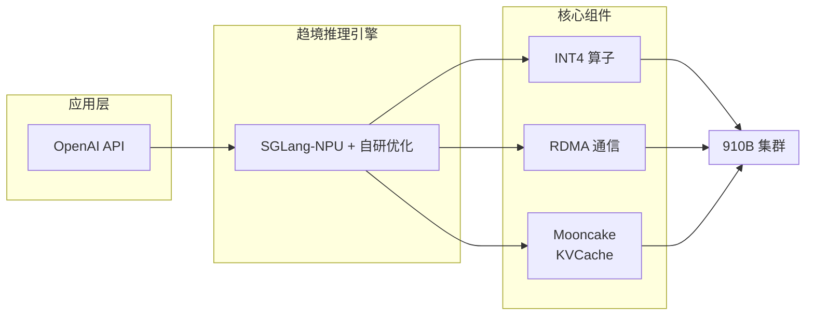
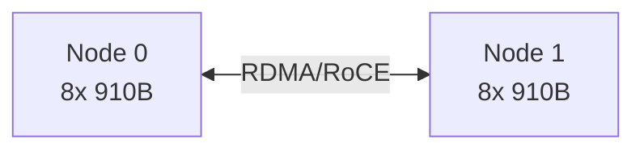
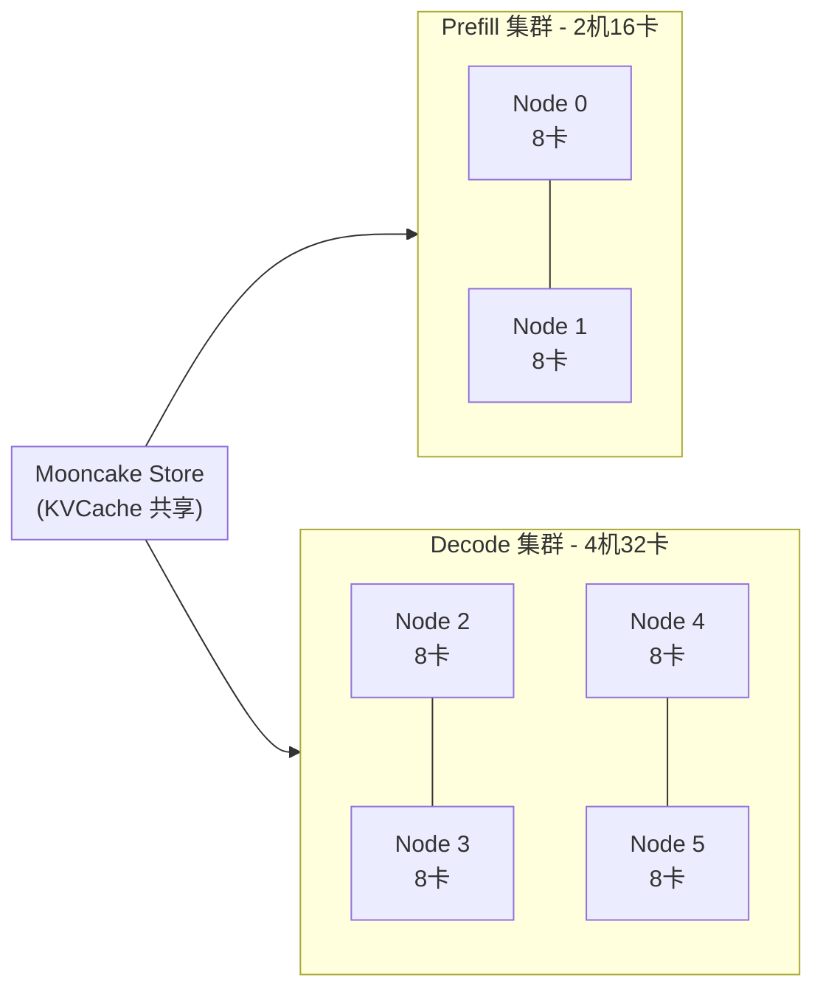

# 昇腾 910B 多机多卡推理方案 - 工作计划

**日期**：2026-01-09
**版本**：v0.1
**状态**：草案

---

## 1. 项目概述

### 1.1 项目背景

基于现有 **昇腾 910B 单机 8 卡方案**，扩展为多机多卡方案，支持更大规模部署和更高并发吞吐。

### 1.2 两个方案

| 方案 | 硬件配置 | 量化方案 | 优先级 |
|------|----------|----------|--------|
| **方案 A** | 2 机 16 卡 | w4a16 | 先做 |
| **方案 B** | 6 机 PD 分离 (2P+4D) | w4a16 | 后做 |

### 1.3 支持模型

| 模型 | 量化方案 | 优先级 | 性能要求 |
|------|----------|--------|----------|
| DeepSeek R1 AWQ | w4a16 | P0 | 速度优先 |
| Kimi K2 Thinking | int4 QAT | P0 | 速度优先 |
| Qwen3 系列 | - | P1 | 功能支持 |

### 1.4 商业项目

| 项目 | 客户 | 关键指标 | 紧急度 |
|------|------|----------|--------|
| 昌平算力中心 | 中软 | 32 并发 @ 30 TPS | **优先** |
| 内部优化 | 中石化 | - | 不着急 |

---

## 2. 性能目标

### 2.1 竞品基线（硅基流动 2 节点 w8a8）

| 场景 | 单并发 TPS | 32 并发 TPS |
|------|-----------|-------------|
| 128-1k | 43.86 | 17.11 |
| 1k-1k | 38.16 | 16.47 |

### 2.2 我们的目标

| 方案 | 单并发 TPS | 32 并发 TPS | 备注 |
|------|-----------|-------------|------|
| **2 机 16 卡** | > 44 | > 17 | 超过硅基流动 |
| **6 机 PD 分离** | - | ≥ 30 | 昌平项目指标 |

### 2.3 我们的优势论点

**w4 vs w8**：
- w4 权重显存占用更小，同等卡数下可支持更大 batch，并且能够支持更长的上下文
- w4a16 精度与 w8a8 相当（需要测试数据支撑）
- 2 机 w4 应该超过 2 机 w8

**竞争策略**：利用长上下文优势对标硅基流动，突出其 w8a8 方案在长上下文场景下显存不足的问题

---

## 3. 技术架构

### 3.1 系统架构

### 3.2 方案 A：2 机 16 卡

- 并行策略：**待研发决定**（可选 TP16 / TP8+PP2 / TP8+EP 等）
- 通信：RDMA/RoCE
- 算子：复用现有单机算子

### 3.3 方案 B：6 机 PD 分离

- Prefill 集群：2 机 16 卡，处理输入
- Decode 集群：4 机 32 卡，处理输出
- KVCache：通过 Mooncake Store 共享
- 目标：32 并发 @ 30 TPS

---

## 4. 阶段计划

### 阶段一：2 机 w4a16 方案

**主要任务：DeepSeek R1 AWQ 2 机性能调试**

| 任务 | 描述 | 依赖 | 目标 |
|------|------|------|------|
| 并行策略选型 | 确定 2 机的 TP/PP/EP 方案 | - | - |
| 跨机通信实现 | RDMA 通信调通 | 并行策略 | - |
| DeepSeek R1 AWQ 适配 | 多机权重加载、并行配置 | 跨机通信 | - |
| 性能调试 | 对标硅基流动，优化性能 | 模型适配 | **超过硅基流动 2 机 w8a8** |

**次要任务：其他模型运行验证**

| 模型 | 任务 | 目标 |
|------|------|------|
| Kimi K2 Thinking | 2 机能够正常运行 | 功能验证 |
| Qwen 235B VL | 2 机能够正常运行 | 功能验证 |

**测试任务（同步进行）**：
| 任务 | 描述 | 目标 |
|------|------|------|
| 精度测试 | 常用 benchmark | 与单机精度一致 |
| w4 vs w8 对比 | 证明 w4a16 精度不比 w8a8 差 | 市场材料 |

**阶段目标**：
- DeepSeek R1 AWQ 2 机 16 卡性能超过硅基流动 2 节点 w8a8
- Kimi K2 Thinking、Qwen 235B VL 能够正常运行
- 精度测试报告完成

### 阶段二：6 机 PD 分离 + 更多模型

> 待阶段一完成后细化

---

## 5. 测试工作项

### 5.1 精度测试

**测试目的**：
- 获取 w8a8 基线分数，证明 w8a8 与官方原精度（DeepSeek FP8 发布分数）也存在差异
- 辅助说明我们的 w4a16 与原精度的差异在可接受范围内

**w8a8 基线测试**（使用 SGLang-NPU 方案）：
- 评测集由测试人员根据常用 benchmark 自行决定
- 原精度基线参考 DeepSeek 官方 FP8 发布分数，无需额外测试

**各模型测试要求**：

| 模型 | 测试范围 | 说明 |
|------|----------|------|
| DeepSeek R1 AWQ (w4a16) | 完整测试 | 与 w8a8 基线对比 |
| Kimi K2 Thinking | 2 个 bench | 原精度模型，简单验证对齐即可 |
| Qwen3 系列 | 暂不测试 | 后续再补充 |

### 5.2 性能测试

**测试目标**：
1. 在保证最低 15 TPS 的情况下，测试最大并发数量
2. **长上下文性能测试**：测试超长上下文场景下的性能表现，突出 w4 方案的显存优势

#### 测试矩阵

| 输入长度 | 输出长度 | 并发数 |
|----------|----------|--------|
| 128 / 1024 / 4K / 8K / 32K | 128 / 512 / 1024 | 逐步增加至 TPS < 15 |
| **64K / 128K**（长上下文） | 1024 | 1 / 4 / 8 |

> 注：长上下文测试重点对比硅基流动 w8a8 方案，其显存占用大，长上下文性能受限

#### 方案 A 目标（2 机 16 卡）

| 场景 | 指标 | 目标 |
|------|------|------|
| 各输入长度 | 最大并发数 | TPS ≥ 15 时的最大并发 |
| 长上下文（64K/128K） | TPS | 优于硅基流动 w8a8 |

**测试环境**：910B 集群环境

**资源需求**：2 机 16 卡，建议使用 **400Gbps 或更高带宽的 RoCE v2 网络**

> 注：方案 B（6 机 PD 分离）的测试计划待方案 A 完成后再制定

### 5.3 竞品对比测试

| 竞品 | 测试场景 | 备注 |
|------|----------|------|
| SGLang-NPU | 同等硬件配置 | 我们的基座 |
| MindIE RC2.2 | 同等硬件配置 | 开源竞品 |
| 硅基流动 | 参考本文档内部数据 | 主要竞对 |

### 5.4 稳定性测试

> 注：稳定性测试在所有方案开发完成后统一进行

| 测试项 | 描述 | 通过标准 |
|--------|------|----------|
| 长时间运行 | 72 小时连续推理 | 无 OOM、无 hang |
| 高并发压测 | 最大并发持续压测 | 无崩溃 |

---

## 6. 市场工作项

### 6.1 核心论点准备

| 论点 | 所需材料 | 状态 |
|------|----------|------|
| **w4 精度不比 w8 差** | 精度对比测试报告 | 待测试 |
| w4 显存效率更高，支持更长上下文 | 显存占用对比 | 待整理 |
| 性能超越竞品 | 性能对比数据 | 待测试 |

### 6.2 w4 vs w8 精度论证

> 本节数据根据精度测试结果填充

| 对比项 | w4a16（我们） | w8a8 基线 | 官方 FP8 | 结论 |
|--------|---------------|-----------|----------|------|
| 待定 | 待测试 | 待测试 | 官方发布 | 待验证 |

**核心结论**：w4a16 激活值保持 16bit，精度与 w8a8 相当

### 6.3 交付物

| 交付物 | 描述 | 优先级 |
|--------|------|--------|
| 性能测试报告 | 2 机 / 6 机方案性能数据 | P0 |
| 精度对比报告 | w4 vs w8 精度对比 | P0 |
| 技术方案白皮书 | 外部可见的方案概述 | P1 |
| Demo 演示环境 | 可演示的推理服务 | P1 |

---

## 7. 里程碑

| 里程碑 | 内容 | 交付物 |
|--------|------|--------|
| M1 | 2 机 16 卡方案可运行 | Demo |
| M2 | 2 机方案性能达标（超硅基） | 性能报告 |
| M3 | 6 机 PD 分离方案可运行 | Demo |
| M4 | 昌平项目指标达成（32并发@30TPS） | 验收报告 |
| M5 | Kimi K2 + Qwen3 支持完成 | 模型支持 |

---

## 附录

### A. 现有单机 8 卡基线数据

| 指标 | 数据 |
|------|------|
| 模型 | DeepSeek-R1-0528-AWQ |
| 硬件 | 昇腾 910B1 × 8 |
| 单并发 TPS (128in) | 43.9 |
| 32 并发 TPS (128in) | 12.3 |
| TTFT (128in) | 340ms |
| vs SGLang | TPS +100%~160% |

### B. 硅基流动竞品数据（2 节点 w8a8）

| 场景 | 单并发 TPS | 32 并发 TPS |
|------|-----------|-------------|
| 128-1k | 43.86 | 17.11 |
| 1k-1k | 38.16 | 16.47 |

### C. 参考文档

- [昇腾 910B 8卡 DeepSeek-R1-0528-AWQ 推理方案](./ascend-deepseek-671b/internal/README.md)
